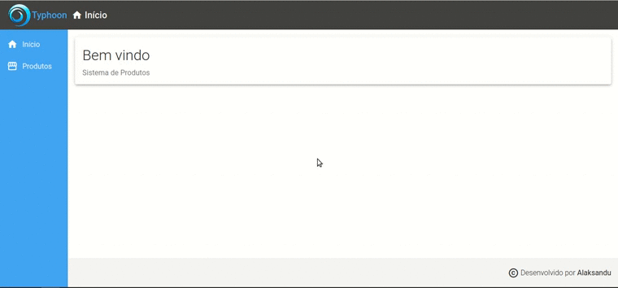

<style type="text/css">
    h1 {color: #42A5F5}
</style>

<h1 align="center" color="blue">
    Demo Typhoon
</h1>

<h1>
    
</h1>

##  About
Project developed in the Essential Angular course taught by Cod3r. The system consists of a simple crud simulating a product manager.

## Technologies
Basically Angular, HTML5, CSS, JavaScript, TypeScript and Angular Material were used as a template resource.

## Run Project

```
$ git clone https://github.com/Alaksandu/ProjetoCod3r.git

$ cd backend

$ npm start

$ cd frontCrud

$ npm start
```

## Certificate
This certificate above verifies that Alexandre de Araújo Veríssimo Mota successfully completed the course Angular Essencial as taught by Leonardo Leitão, Cod3r Cursos. The certificate indicates the entire course was completed as validated by the student.


## Contact

- Linkedin: https://www.linkedin.com/in/alexandre-de-araujo-verissimo-mota-278a82101/
- Github: https://github.com/Alaksandu


